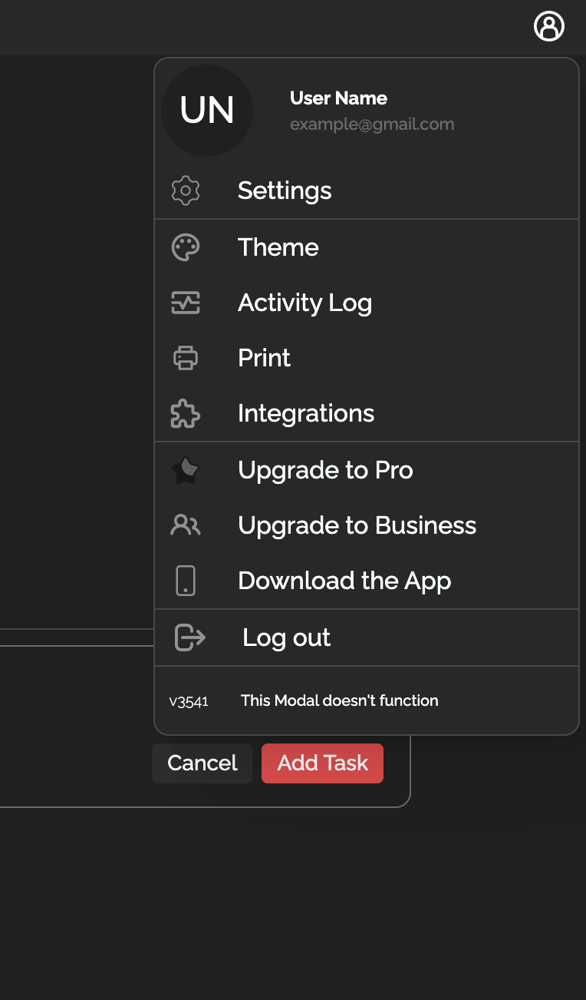
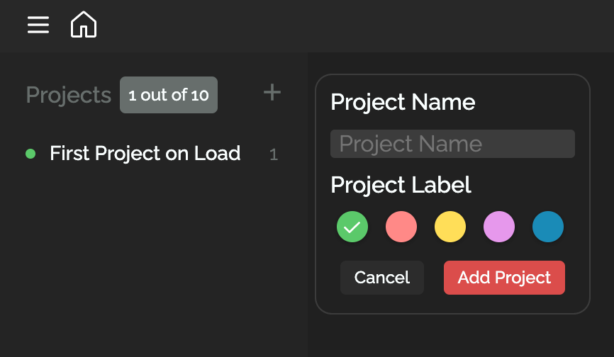

<a name="readme-top"></a>
[![LinkedIn][linkedin-shield]][linkedin-url]


<!-- TABLE OF CONTENTS -->
<details>
  <summary>Table of Contents</summary>
  <ol>
    <li>
      <a href="#about-the-project">About The Project</a>
      <ul>
        <li><a href="#built-with">Built With</a></li>s
      </ul>
    </li>
    <li>
      <a href="#getting-started">Getting Started</a>
      <ul>
        <li><a href="#prerequisites">Prerequisites</a></li>
        <li><a href="#installation">Installation</a></li>
      </ul>
    </li>
    <li><a href="#usage">Usage</a></li>
    <li><a href="#roadmap">Roadmap</a></li>
    <li><a href="#contributing">Contributing</a></li>
    <li><a href="#license">License</a></li>
    <li><a href="#contact">Contact</a></li>
    <li><a href="#acknowledgments">Acknowledgments</a></li>
  </ol>
</details>


<!-- ABOUT THE PROJECT -->
## About The Project
<div></div>

![Todoist CLone Main Screenshot][product-screenshot-main]
<div style="display: flex; flex-direction: column; align-items: center; justify-content:center;">
    
    
</div>

![Add Task Modal Screenshot][product-screenshot-add-task]
![Figma Design Board Screenshot][product-screenshot-figma]

"The main goal of this project was to master vanilla JavaScript by cloning one of my all-time favorite web applications, "Todoist." It's a super effective task tracking app that was able to manage all the small tasks I needed to complete in a day.
I wanted to be able to fully clone a website before jumping into any frameworks and additional tech abstractions to solidify my foundation and understanding of web development."

Learning Objectives
* Javascript ES6 -> Closure, modules, design patterns (module pattern, factory functions, singleton pattern*), OOP princples.
* Package Managers (NPM) ->  dependencies, NPM scripts (npm run build), repository of plugins!
* Webpack -> Module bundler, loaders, entry and output points, transpilers, dependency tree for your JS/images/JSON/CSV files.
* Figma -> UX/UI design, power of SVGs, designing custom icons and images.
* Advanced CSS -> :root properties, responsive web design, advanced query selectors and animations.
* Advanced HTML -> Form validation, transforms and transitions (keyframes).

<p align="right">(<a href="#readme-top">back to top</a>)</p>

### Built With

[![Webpack][webpack-shield]][webpack-url] [![JavaScript][javascript-shield]][javascript-url] [![HTML][html5-shield]][html5-url] [![CSS3][css3-shield]][css3-url] [![Figma][figma-shield]][figma-url] [![Adobe Creative Cloud][adobe-creative-cloud-shield]][adobe-creative-cloud-url]


<p align="right">(<a href="#readme-top">back to top</a>)</p>


<!-- GETTING STARTED -->
## Getting Started

### Prerequisites

Install latest version of NPM

* npm
  ```sh
  npm install npm@latest -g
  ```

### Installation


1. Clone the repo
   ```sh
   git clone https://github.com/JosiahSchwahn/todoist-clone
   ```
2. Install NPM packages from Node Modules
   ```sh
   npm install
   ```
3. Run NPM Script Build
   ```sh
   npm run build
   ```
4. Run local host from HTML file

<p align="right">(<a href="#readme-top">back to top</a>)</p>


<!-- USAGE EXAMPLES -->
## Usage

*Todoist Clone*

<p align="right">(<a href="#readme-top">back to top</a>)</p>


<!-- CONTRIBUTING -->
## Contributing

Contributions are what make the open source community such an amazing place to learn, inspire, and create. Any contributions you make are **greatly appreciated**.

If you have a suggestion that would make this better, please fork the repo and create a pull request. You can also simply open an issue with the tag "enhancement".
Don't forget to give the project a star! Thanks again!

1. Fork the Project
2. Create your Feature Branch (`git checkout -b feature/AmazingFeature`)
3. Commit your Changes (`git commit -m 'Add some AmazingFeature'`)
4. Push to the Branch (`git push origin feature/AmazingFeature`)
5. Open a Pull Request

<p align="right">(<a href="#readme-top">back to top</a>)</p>


<!-- LICENSE -->
## License

Distributed under the MIT License. See `LICENSE.txt` for more information.

<p align="right">(<a href="#readme-top">back to top</a>)</p>


<!-- CONTACT -->
## Contact

Josiah Schwahn - schwahn.josiah@gmail.com | josiah@missionranch.co

Project Link: [[https://github.com/your_username/repo_name](https://github.com/your_username/repo_name)](https://github.com/JosiahSchwahn/todoist-clone)

<p align="right">(<a href="#readme-top">back to top</a>)</p>


<!-- ACKNOWLEDGMENTS -->
## Acknowledgments

* [The Odin Project <3](https://www.theodinproject.com/dashboard)
* [MDN](https://developer.mozilla.org/en-US/)
* [Glass UI](https://ui.glass/generator/)
* [notion](https://www.notion.so/)

<p align="right">(<a href="#readme-top">back to top</a>)</p>

<!-- MARKDOWN LINKS & IMAGES -->

[license-url]: https://github.com/othneildrew/Best-README-Template/blob/master/LICENSE.txt
[linkedin-shield]: https://img.shields.io/badge/-LinkedIn-black.svg?style=for-the-badge&logo=linkedin&colorB=555
[linkedin-url]: https://www.linkedin.com/in/josiah-schwahn-b58522184/

[product-screenshot-main]: screenshots/todoist-clone-screenshot.png 
[product-screenshot-figma]: screenshots/figma-icon-screenshot.png
[product-screenshot-add-task]: screenshots/add-task-modal-screenshot.png

[webpack-shield]: https://img.shields.io/badge/Webpack-8DD6F9?style=for-the-badge&logo=Webpack&logoColor=white
[figma-shield]: https://img.shields.io/badge/Figma-F24E1E?style=for-the-badge&logo=figma&logoColor=white
[adobe-creative-cloud-shield]: https://img.shields.io/badge/Adobe%20Creative%20Cloud-DA1F26?style=for-the-badge&logo=Adobe%20Creative%20Cloud&logoColor=white
[javascript-shield]: https://img.shields.io/badge/JavaScript-F7DF1E?style=for-the-badge&logo=javascript&logoColor=black
[html5-shield]: https://img.shields.io/badge/HTML5-E34F26?style=for-the-badge&logo=html5&logoColor=white
[css3-shield]: https://img.shields.io/badge/CSS-239120?&style=for-the-badge&logo=css3&logoColor=white

[webpack-url]: https://webpack.js.org/
[figma-url]: https://www.figma.com/
[adobe-creative-cloud-url]: https://www.adobe.com/creativecloud.html
[javascript-url]: https://www.javascript.com/
[css3-url]: https://www.w3.org/Style/CSS/Overview.en.html
[html5-url]: https://html.com/


